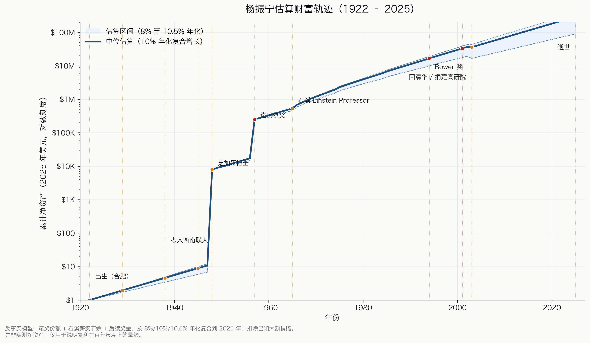
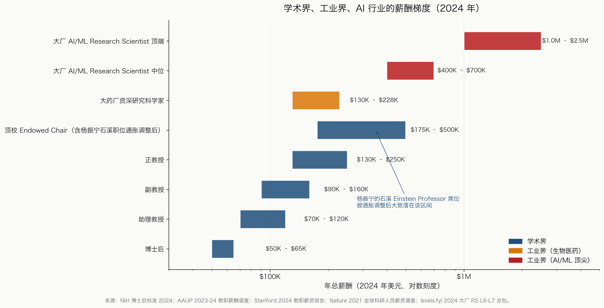
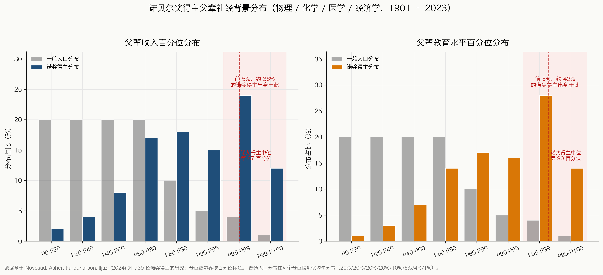
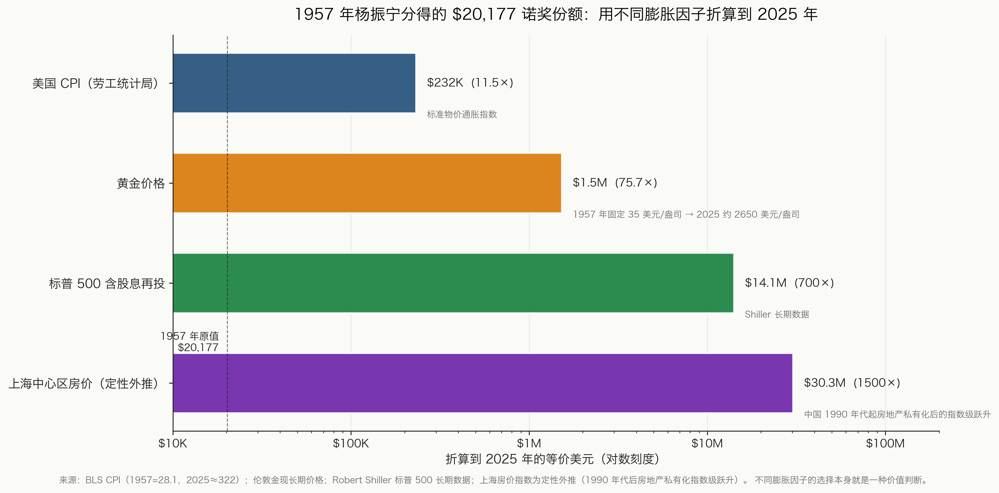
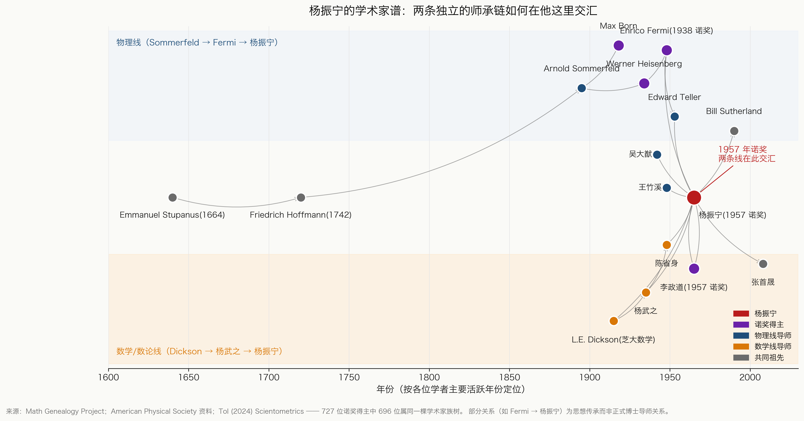
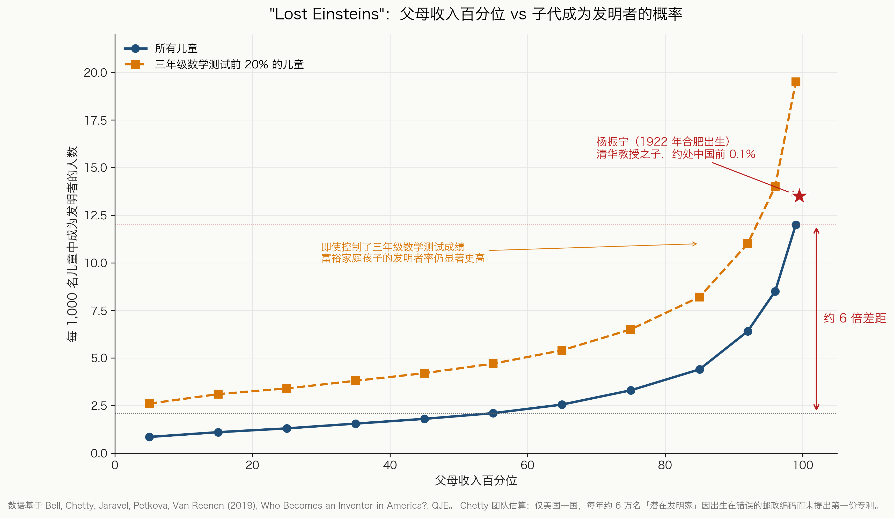

# Yang Zhenning Wealth Figures

Configuration-driven matplotlib scripts that generate the 6 data figures accompanying the blog post:

> **How Rich Is Chen Ning Yang?**
> - English: https://ktwu01.github.io/posts/2026/05/yang-zhenning-wealth-questions/
> - 中文：https://ktwu01.github.io/zh/posts/2026/05/yang-zhenning-wealth-questions/

Browse the figures on a dedicated site:

- 中文版（默认）: **https://ktwu01.github.io/yang-zhenning-wealth-figures/**
- English version: **https://ktwu01.github.io/yang-zhenning-wealth-figures/index.en.html**

Each figure is reproducible from a CSV in `data/` plus a single Python file in `src/`. PNGs in `output/` (Chinese labels) and `output/en/` (English labels) are tracked for README and website embedding; SVG vector backups are regenerated via `make all` / `make all-en` and not committed.

## Quick start

```bash
pip install -r requirements.txt

make all        # generate all 6 Chinese figures into output/
make all-en     # generate all 6 English figures into output/en/
make fig1       # or one at a time (Chinese)
make fig1-en    # one at a time (English)

# Or call the scripts directly with the FIG_LANG env var
FIG_LANG=en python3 src/fig1_wealth_timeline.py
```

The language switch is driven by the `FIG_LANG` environment variable (`zh` by default). Outputs land in `output/` (Chinese) or `output/en/` (English) as PNG (300 dpi, for embedding) and SVG (vector backup).

---

## The 6 figures

### Figure 1: Yang Zhenning's estimated wealth trajectory, 1922–2025



Counterfactual compound-growth model on a log scale. Nobel share (1957) + Stony Brook salary deposits (1966–1999) + later prizes, grown at 8%, 10%, and 10.5% CAGR scenarios, with documented charitable gifts deducted. Endpoint range is $10M–$50M, not a point estimate. The nearly vertical jump between PhD (1948) and Nobel (1957) is the most informative feature, not the endpoint.

- Source: [`src/fig1_wealth_timeline.py`](src/fig1_wealth_timeline.py)
- Data: [`data/yang_wealth_timeline.csv`](data/yang_wealth_timeline.csv)

### Figure 2: Academic, industry, and AI compensation gradient (2024)



2024 USD salary ladder across 8 tiers, log scale: postdoc → assistant → associate → full professor → endowed chair → biotech industry PhD → FAANG AI Research Scientist. A top-university endowed chair's ceiling sits roughly at the floor of a senior AI research scientist's total comp. Spans more than 40×.

- Source: [`src/fig2_salary_comparison.py`](src/fig2_salary_comparison.py)
- Data: [`data/salary_comparison.csv`](data/salary_comparison.csv)

### Figure 3: Nobel laureate parental socioeconomic background



Distribution of Nobel laureates' parental income and education percentiles vs. the contemporaneous general population. Approximately 50–60% of laureates come from top-5% households; average laureate parental income is the 87th percentile and parental education is the 90th percentile.

- Source: [`src/fig3_nobel_background.py`](src/fig3_nobel_background.py)
- Data: [`data/nobel_socioeconomic.csv`](data/nobel_socioeconomic.csv)
- Reference: Novosad, Asher, Farquharson, Iljazi (2024), [Access to Opportunity in the Sciences](https://paulnovosad.com/pdf/nobel-prizes.pdf).

### Figure 4: 1957 Nobel share, four deflators



Yang's $20,177 1957 Nobel share, projected to 2025 USD under four different deflators (US CPI, gold, S&P 500 total return, Shanghai real estate). The range spans 130×. Every deflator carries a value judgment; none is "objectively correct." This is why any single inflation number is misleading.

- Source: [`src/fig4_purchasing_power.py`](src/fig4_purchasing_power.py)
- Data: [`data/purchasing_power_1957.csv`](data/purchasing_power_1957.csv)

### Figure 5: Academic genealogy of Yang Zhenning



Two parallel mentorship chains converging at Yang Zhenning. Physics line: Sommerfeld → Born/Heisenberg → Fermi → Teller → Yang. Math line: Dickson → Yang Wuzhi → Yang. Chen Xingshen (S.S. Chern), a former student of Yang Wuzhi, later served as Yang Zhenning's mentor at Southwest Associated University, closing one of the loops. Some edges (e.g., Fermi → Yang) are intellectual influence rather than formal PhD advising.

- Source: [`src/fig5_academic_genealogy.py`](src/fig5_academic_genealogy.py)
- Data: [`data/academic_genealogy.csv`](data/academic_genealogy.csv)
- Reference: Tol (2024), [The Nobel Family](https://link.springer.com/article/10.1007/s11192-024-04936-1), *Scientometrics* 129:1329–1346.

### Figure 6: Lost Einsteins, inventor rate by parental income



Reproduction of the central plot from Bell, Chetty et al. (2019, *QJE*): inventor rate per 1000 children by parental income percentile, with and without controlling for early math ability. A 6–10× gap between wealthy and median families persists even after controlling for third-grade math test scores. Red star marks Yang Zhenning's birth position in 1922 (top 0.1% of the Chinese income distribution).

- Source: [`src/fig6_lost_einsteins.py`](src/fig6_lost_einsteins.py)
- Data: [`data/chetty_inventor_rates.csv`](data/chetty_inventor_rates.csv)
- Reference: Bell, Chetty et al. (2019), [Who Becomes an Inventor in America?](https://academic.oup.com/qje/article/134/2/647/5218522), *QJE* 134(2):647–713.

---

## Repository layout

```
.
├── data/                       # CSVs with source notes in comments
├── src/
│   ├── style.py                # shared matplotlib styling
│   └── fig{1..6}_*.py          # one script per figure
├── output/                     # Chinese-labelled PNG (tracked) + SVG (gitignored)
│   └── en/                     # English-labelled PNG (tracked) + SVG
├── index.html                  # GitHub Pages site, Chinese default
├── index.en.html               # English mirror of the site
├── Makefile
├── requirements.txt
└── LICENSE                     # MIT
```

## Data provenance and honesty

Every CSV starts with a comment block citing the underlying source. A few important caveats:

- **Figure 1 is a model, not a measurement.** Yang Zhenning never published audited net-worth figures. The trajectory is built from public biographical anchors (salaries by tier, prize amounts, documented charitable gifts) compounded forward under three CAGR scenarios. The 2025 endpoint of $10M–$50M is a range, not a point estimate, and it represents accumulated principal minus known major gifts.
- **Figure 3** uses stylized bins consistent with the numerical findings reported by Novosad, Asher, Farquharson, and Iljazi (2024). The exact within-bin shares are illustrative; the medians (P87 income, P90 education) and top-5% share (~50–60%) are the verified takeaways.
- **Figure 4** uses CPI and gold prices that are public record. The S&P 500 multiplier (~700×) is the Shiller long-run total return; the Shanghai housing multiplier (~1500×) is directional, extrapolating from the post-1990 privatization-era price index.
- **Figure 5** is a curated subset of a large genealogy. Some links (Fermi → Yang) reflect documented intellectual influence rather than the official PhD-advisor relation (which was Edward Teller).
- **Figure 6** reproduces the qualitative shape of Bell et al. 2019. The bin-level numbers are stylized to match the published curve.

If you spot an error in a CSV or a script, please open an issue or PR.

## License

MIT. See [`LICENSE`](LICENSE). Use the figures freely, with attribution to the blog post.
